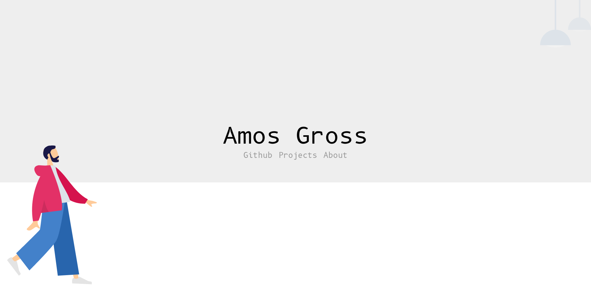

# My Homepage

## Description

This Repo represents the souce code to my website, that can be found under https://www.amosgross.com. 

It is based on the [Hugo framework](https://gohugo.io/), a static site generator, that manages it's content with markdown.
Unlike Wordpress, Angular, React, etc. Hugo is extremly light weight, essentially being only some css and html with whatever content was provided in Markdown. Good websites don't need bloat.

## The Repository

### Branching
As of right now the repo contains the following main branches:
- **master** - contains the current code running on the website, hooks into the CI/CD pipeline
- **hugo** - the current development branch, all code that isn't ready tp be published is versioned here
- **angular** - this repo/website used to be an angular website (very bloaty), that version of the site is still kept in this branch for historical reasons

### CI/CD Pipeline
An issue I personally had with my previous homepages was that I constantly make mistakes. Most of these tend to be very minor spelling errors, which given the time needed to build and deploy a new version of the site, mostly remain unfixed.

My way of solving this was twofold
1. All content (and thus spelling) is managed though markdown and not html, making it very easy to correct spelling mistakes even from the Github gui
2. Publishing the site is handled by a Github Actions pipeline, that is hooked into master

Given both of these, most minor changes can now be done in a matter of seconds from the github gui. Instead of having to worry about editing source code and going through the annoying process of deploying it.
